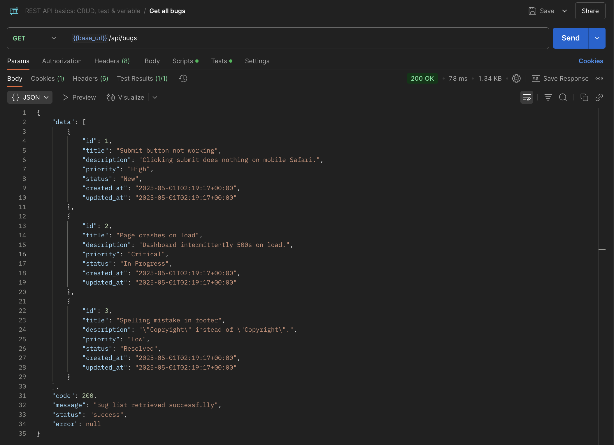
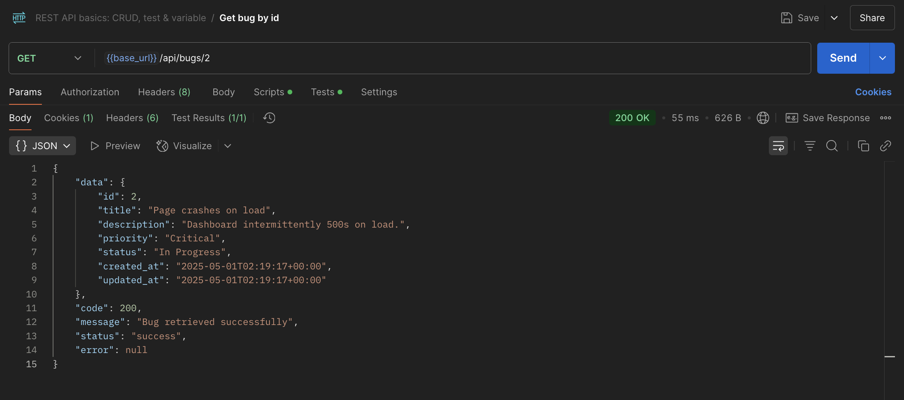

# Oops

**Oops** is a simple bug tracker built with a CakePHP API and Vue 3. Submit, view, and update bugs. No auth, no fluff—just bugs.

## Stack

- **Frontend**: [Vue 3](https://vuejs.org/) with [Tailwind CSS](https://tailwindcss.com/)  
- **Backend**: [CakePHP](https://cakephp.org/) serving a RESTful JSON API  
- **Database**: SQLite

## Project Structure

<code>/oops/
├── api/                # CakePHP API
├── web/                # Vue 3 + Tailwind frontend
├── LICENSE             # MIT license
├── README.md           # You're here
</code>

## MVP Features

- **Bug Submission**: Submit a bug with title, description, and priority  
- **Bug Listing**: View submitted bugs with color-coded priorities and status  
- **Bug Details**: View full details of a bug and update its status  
- **Filters**: Toggle to filter bugs by priority or status  
- **No authentication**: Just bugs, no logins required  

## API Design

### Endpoints

1. **GET /api/bugs**
   - **Description**: Retrieve a list of all bugs ordered by creation date (newest first).
   - **Response**: A list of bugs with their `id`, `title`, `priority`, `status`, and `created_at`.
   - **Example Response**:
     ```json
     {
       "data": [
         {
           "id": 1,
           "title": "Bug Title",
           "priority": "High",
           "status": "New",
           "created_at": "2025-04-30T12:00:00"
         }
       ],
       "code": 200,
       "message": "Bug list retrieved successfully",
       "status": "success",
       "error": null
     }
     ```

2. **GET /api/bugs/{id}**
   - **Description**: Retrieve details of a specific bug by `id`.
   - **Response**: The full details of the requested bug.
   - **Example Response**:
     ```json
     {
       "data": {
         "id": 1,
         "title": "Bug Title",
         "description": "Detailed bug description",
         "priority": "High",
         "status": "In Progress",
         "submitter": "John Doe",
         "created_at": "2025-04-30T12:00:00"
       },
       "code": 200,
       "message": "Bug retrieved successfully",
       "status": "success",
       "error": null
     }
     ```

3. **POST /api/bugs**
   - **Description**: Create a new bug.
   - **Request Body**:
     ```json
     {
       "title": "Bug Title",
       "description": "Bug Description",
       "priority": "Medium",
       "status": "New",
       "submitter": "John Doe"
     }
     ```
   - **Response**: The newly created bug, including `id`, `title`, `priority`, `status`, and `created_at`.
   - **Example Response**:
     ```json
     {
       "data": {
         "id": 1,
         "title": "Bug Title",
         "priority": "Medium",
         "status": "New",
         "created_at": "2025-04-30T12:00:00"
       },
       "code": 201,
       "message": "Bug created successfully",
       "status": "success",
       "error": null
     }
     ```

4. **PATCH /api/bugs/{id}**
   - **Description**: Update a specific bug's details.
   - **Request Body**:
     ```json
     {
       "status": "Resolved"
     }
     ```
   - **Response**: The updated bug with its new details.
   - **Example Response**:
     ```json
     {
       "data": {
         "id": 1,
         "title": "Bug Title",
         "priority": "High",
         "status": "Resolved",
         "created_at": "2025-04-30T12:00:00"
       },
       "message": "Bug updated successfully",
       "status": "success",
       "error": null
     }
     ```

5. **DELETE /api/bugs/{id}**
   - **Description**: Delete a specific bug.
   - **Response**: Success or error message.
   - **Example Response**:
     ```json
     {
       "data": null,
       "message": "Bug deleted successfully",
       "status": "success"
     }
     ```

## Status

This project is in-progress. Feedback and improvements welcome!

## Feedback

If you have suggestions, or just want to talk about minimal app design, open an issue or get in touch!

## Screenshots

